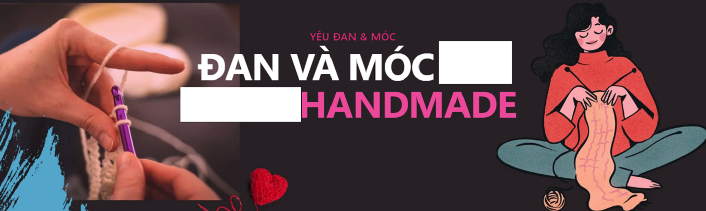
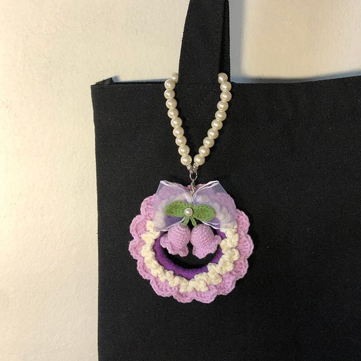
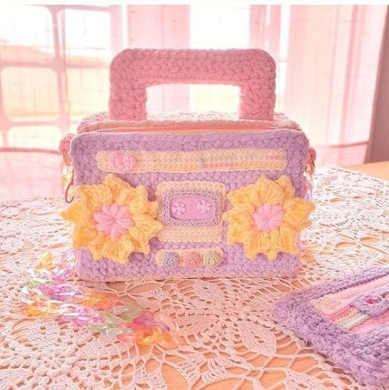

<!DOCTYPE html>
<html lang="en">
<head>
    <meta charset="UTF-8">
    <link rel="icon" type="image/jpg" href="pics/favicon.jpg">
    <meta name="viewport" content="width=device-width, initial-scale=1.0">
    <title>CROCHET</title>
    <link rel="stylesheet" href="css/header.css">
    <link rel="stylesheet" href="css/body.css">
    <link rel="stylesheet" href="https://unpkg.com/boxicons@2.1.4/css/boxicons.min.css">
    <link rel="stylesheet" href="css/login.css">
<!--swiper css
    <link rel="stylesheet" href="css/swiper-bundle.min.css">
-->
</head>
<body style="background-color: rgb(245, 201, 208);">
<header id="fix">
    

        
    

    
     
 

    <button onclick="document.getElementById('id01').style.display='block'" style="width:auto;" id="login">SIGN IN</button>    
    <button id="login"><a href="register.html">REGISTER</a></button>

  
  <form class="modal-content animate" action="/action_page.php" method="post">
    

        &times;
        
      

    

        <h2>LOGIN FORM</h2>
      <label for="uname"><b>Username</b></label>
      <i class='bx bxs-user' ></i>
      <input type="text" placeholder="Username" required>
      

      <label for="psw"><b>Password</b></label>
      <i class='bx bxs-lock-alt'></i>
      <input type="password" placeholder="Password" required>
        
      <label>
        <input type="checkbox" checked="checked" name="remember"> Remember me
      </label>
       
      <button type="submit" class="dn">Login</button>
    

    

      <button type="button" onclick="document.getElementById('id01').style.display='none'" class="cancelbtn">Cancel</button>
      Forgot <a href="#">password?</a>
      Don't have an account?<a href="register.html">Register</a>
    

  </form>

<!--   <button id="dangnhap">
        <a  href="register.html">REGISTER</a>
    </button>
    --> 
 

 

    
            
        <input type="search" id="search" placeholder="Tìm kiếm...">
        <a href="#" class="search-btn">
            <i class='bx bx-search-alt-2'></i>
        </a>
    

     
    

        <ul class="navbar">    
            <li><a href="index.html"><b>MENU</b></a></li>
            <li><a href="intro.html"><b>ABOUT</b></a></li>
            

                <li><a href="product.html"><b>PRODUCT</b></a></li>
                

                    <a href="">Flower</a>
                    <a href="">Stuffed animal</a>
                    <a href="">Key chain</a>
                    <a href="">Clothes</a>
                    <a href="">Tote</a>
                    <a href="">...</a>
                

            

           
            

                <li><a href="learn.html"><b>LEARN</b></a></li>
                

                    <a href="">Basic chart</a>
                    <a href="">Another chart</a>
                

            

            <li><a href="shop.html"><b>SHOP</b></a></li>
            <li><a href="contact.html"><b>CONTACT</b></a></li>
           
        </ul>
    

    
</header>

    

    <table class="khunggt">
        <tr>
        <th class="slide">

            

                <h2><a href="learn.html">Share for free</a></h2>
                
Share useful knitting knowledge and interesting crochet tips

            

        
</th>
        <th>

            

                <h2><a href="">Shopping</a></h2>
                
All kinds of cheap and quality knitting accessories, reputable handmade gifts

            

        
</th>
        </tr>
    </table>
     
    <table>
        <tr>
            <th class="vid">
                <video width="400px" height="400px" controls autoplay>
            <source src="pics/vid.mp4">
        </video>
    </th>
        <th id="content">
            <h3>WHAT IS CROCHET?</h3>
            
Crochet is a type of needlecraft in which you use a hook to create fabric from loops of yarn. Crochet can be used to make everything from blankets and scarves to hats and sweaters. If you’re looking for a fun, creative way to spend your free time, crochet may be the perfect activity for you!

            

             
            <h3>CROCHET HANDMADE</h3>
            

                This is a website specializing in sharing easy-to-understand handmade instructions, especially wool and yarn handmade.
                At the same time, this is a place that provides reputable, quality, good-priced woolen yarn, crocheted accessories and handmade gifts to meet everyone's needs.
            

        </th>
        </tr>
    </table>

    

        <h1>SOME PRODUCTS</h1>
        

            

                

                    
                

                

                    <h4>Chick Amigurumi</h4>                        
                    
Cute wool chicken stew keychain...

                    <button class="button"><a href="">Detail</a></button>  
                
  
            

    
            

                

                    
                

                

                    <h4>A Basket Of Flowers</h4>                        
                    
Mini flower basket made of wool...

                    <button class="button"><a href="">Detail</a></button>  
                
  
            

    
            

                

                    
                

                

                    <h4>Rabit Keychain</h4>                        
                    
fdhgfythhgbdhfuehufjhueufffffffsd...

                    <button class="button"><a href="">Detail</a></button>  
                
  
            

    
            

                

                    
                

                

                    <h4>Flower Tote Bag</h4>                        
                    
fdhgfythhgbdhfuehufjhueufffffffsd...

                    <button class="button"><a href="">Detail</a></button>  
                
  
            

    
            

                

                    
                

                

                    <h4>Sweet Woman Crop Top</h4>                        
                    
fdhgfythhgbdhfuehufjhueufffffffsd...

                    <button class="button"><a href="">Detail</a></button>  
                
  
            

    
            

                

                    
                

                

                    <h4>Car Pandent</h4>                        
                    
fdhgfythhgbdhfuehufjhueufffffffsd...

                    <button class="button"><a href="">Detail</a></button>  
                
  
            

    
            

                

                    
                

                

                    <h4>A Basket Of Flowers</h4>                        
                    
Mini flower basket made of wool...

                    <button class="button"><a href="">Detail</a></button>  
                
  
            

    
            

                

                    
                

                

                    <h4>Headbands</h4>                        
                    
fdhgfythhgbdhfuehufjhueufffffffsd...

                    <button class="button"><a href="">Detail</a></button>  
                
  
            

    
            

                

                    
                

                

                    <h4>Christmas Decorate</h4>                        
                    
The most adorable crochet Christmas Tree...

                    <button class="button"><a href="">Detail</a></button>  
                
  
            

    
            

                

                    
                

                

                    <h4>Boombox Bag</h4>                        
                    
If you love retro like we do,...

                    <button class="button"><a href="">Detail</a></button>  
                
  
            

            

                

                    
                

                

                    <h4>Tulip</h4>                        
                    
...

                    <button class="button"><a href="">Detail</a></button>  
                
  
            

    
            

                

                    
                

                

                    <h4>Floral Square Shoulder Bag</h4>                        
                    
This mini cable bag free...

                    <button class="button"><a href="">Detail</a></button>  
                
  
            

    
            

                

                    
                

                

                    <h4>Chinchilla Doll</h4>
                    
...

                    <button class="button"><a href="">Detail</a></button>  
                
  
            

            

                <button id="buttonmore">
                    <a href="product.html"><i class='bx bx-dots-horizontal-rounded'></i></a>                    
                </button>
            

        

    

     
    

    <footer style="background-color: rgb(124, 116, 124);" align="center">
        by: NgocTram 
        &copy; copyright reserved 
        <a href="mailto: truongtram2k4@gmail.com"><i class='bx bxl-gmail'></i>Mail</a>
    </footer>

</body>

</html>
